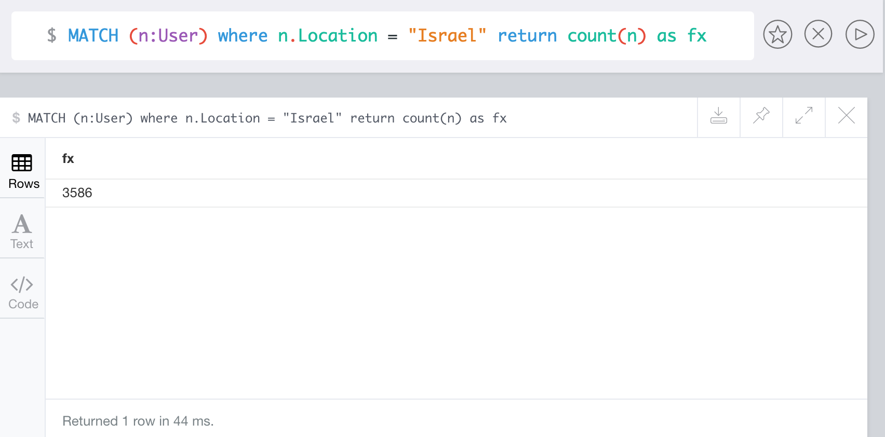

##Readme_根据地址匹配国家

注册时填写地址信息是一个很常见的操作。而我们需要根据在StackOverFlow上用户填写的地址信息，判断分析出该用户是来自哪个国家的。由于该平台规范化地址的格式，只是由用户直接填写。因此我们只能根据经验规律来推测其归属地。比如填写成“Johnson City, TN, United States”我们几乎可以断言他是来自美国的。不过有些用户实在是瞎写地址，比如"Europe (all of it... I'm really fat)"这个显然就不能揣测出这位神仙来自哪里。因此我们只能尽可能去推测寻找。得到的结果也只能是很大程度上可能正确，毕竟如果用户瞎填一个地址或者写一个很有歧义(比如很多国家都有的地名)，我们很难正确地得到结果。

其中由于很多的地址是重复的。我们需要先把不同的匹配出来，再连接到数据库进行查找，就可以查出1e6中每个国家有多少了。其中前者是用c++实现的，后面的是在已有java工程的基础上连接数据库进行操作的。

-------
###C++_不同的地址匹配国家
共分为两大部分。

####第一部分是国家的匹配。

首先进行国家名称的匹配，这一轮是200多个国家名称的匹配，转化成小写匹配。这样可以让用户填的全是小写例如“india”被匹配出来。


~~然后是常见城市的匹配，用csv中的数据去find有没有常见城市。即有没有常见城市的子串。由于常见城市有的名字很短，因此必须大小写匹配。~~

(上面这一段最后删去了，因为有些城市的名字太短比如就两个字母Ca，然后诸如California都会被它吞掉，故删去)

_*第一部分大概能执行出2w-3w的数据，即大多数人还是会填自己的国家信息的。*_

####然后是第二部分，一般城市的匹配。

构造一个字典树存放大量的城市的名字及对应的国家。把读入的csv的每一行首先进行字典树查找，然后去掉末尾的两个大写字母(如果是这种格式)进行匹配，然后将它从分成若干以大写字母开头的单词进行字典树查找。

####最终结果形式


最终生成的文件为tojava.txt，它以Location::::::Cnt的形式输出了Location这个地点的出现次数为Cnt次。

unknown.txt这个文件输出的是没有检测出来的地点信息。

在控制台也输出了同tojava.txt展示的信息，并在最后的末尾输出了国家出现次数的排名（每条指令在数据库中出现了多次，在java里另行计算）

###java根据重复数求出最终结果

因为每一条指令在数据库中可能出现多次(即多个用户可能填的是相同的地址)，我们需要把重复的指令加上出现的次数。访问数据库的可视化界面如下(在java中调用连接到数据库的api即可）




如上图，我们查询有多少个人写的是Israel，发现有3586人写的是这个，即有3586个写成这种格式的应该都是来自以色列的。

主要代码在/src/main/java/buaa/act/baseServive/Init.java中。

最终的结果保存在output.txt中。根据每个国家的地址次数从高到低排列。其中detail.txt中保存的是每一条地址的询问出来的详细信息。例如:

```
Auckland, New Zealand     New Zealand     1133*****MATCH (n:User) where n.Location = "Auckland, New Zealand" return count(n) as fx
```
代表的就是地址为`Auckland, New Zealand`,我们之前推测出这个地址所在的国家为`New Zealand`,然后访问这个地址在数据库中出现的次数为1133次。******之后的是我们访问数据局的指令。

###结果分析


```
MATCH (n:User) return count(n) as fx
```

返回所有的指令数，为：5987285

```
MATCH (n:User) where n.Location = "" return count(n) as fx
```

返回所有的非空指令数，为：5135927。因此代码所有的非空指令（包含重复）数，为：5987285 - 5135927 = 851358

```
MATCH (n:User) return count(distinct n.Location) as fx
```

去重后的指令个数为：67143。在这么多指令中，我们完全不能推测出来的有9381个地址，找出来有56795个地址。比率为84.6%

而访问数据库统计相同的地址后，我们最终推测出来的地址数为：826424。比例达到97.1%


